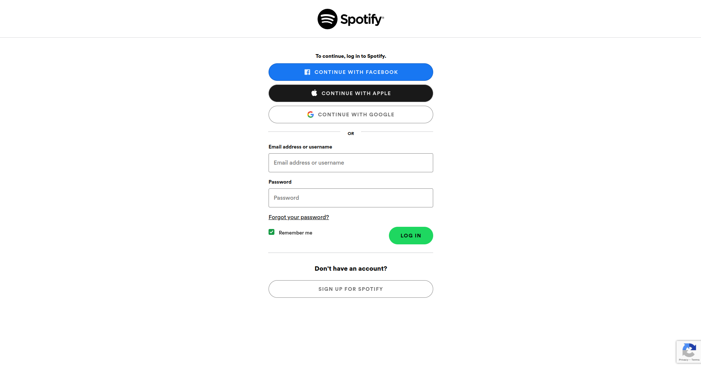

# Spotify login mock page

Hey, thanks for checking out the project.  
The whole idea is to just brush up on old html/CSS skills. Feel free to add to it, but keep in mind that we want to replicate a specific style.

It should look like [this](https://accounts.spotify.com/en/login?continue=https%3A%2F%2Fopen.spotify.com%2F%3F):  

## BRANCHING!

Make sure you work on a different branch so we can compare code.